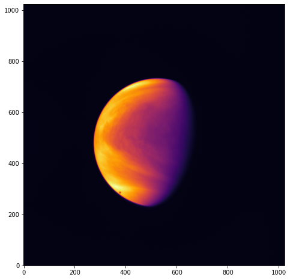
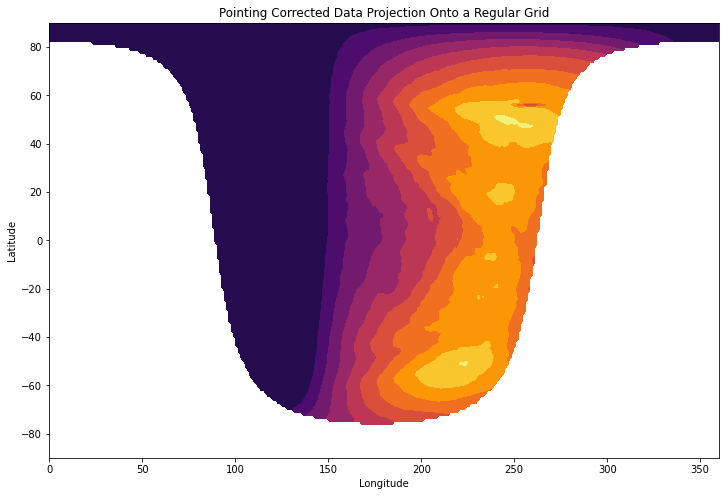

# Venus-image-processing
Reproduction of the Akatsuki Level-2 to Level-3 image processing pipeline from published papers. Essentially we go from an image with known geometry like the following:

to data on a regular latitude-longitude grid that is much more convenient for scientific analysis: 

References and comments are included within the Jupyter notebook.